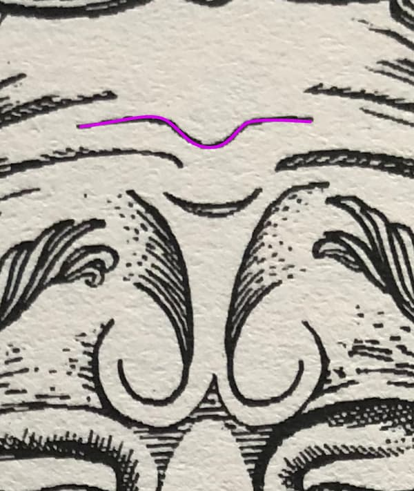
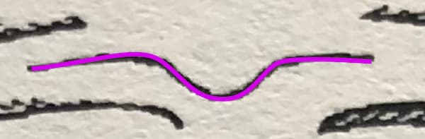

Take a look at the image below. It’s a plate from Poor Things by Alasdair Gray. It’s a character called Goodwin Baxter, a kind of proto-Dr Frankenstein.

See any similarities between that and the purple squiggle above?

## Look closer...

## There it is!

## Sweating the (image) assets

I was looking for something to add a bit of colour and break up the blocky straight edges of the visual design. I just liked the look of that line so I traced it.

I’ve dropped it into the header section as an inline svg.

It’s only 546 characters worth of code which equates to 546 bytes more weight to the page, but that’s nothing. That’s half of 1 Kilobyte, or half of 1 thousandth of a Megabyte. An average iPhone X photo weighs in with a filesize of 3MB. So that line is 0.0182 of a percent of the filesize of an iPhone photo.

Every time that line is viewed online, it uses 0.0182% of the energy required to share an iPhone photo.

Or, to put it another way, that line could be viewed on a web page 5,495 times before it would match the energy required to upload one iPhone image to Instagram.

I think it provides a huge amount of visual interest and character for a few bytes.

And I love the fact that it’s a furrow on his brow. A tiny detail. But there’s a lot of thought went into it.

