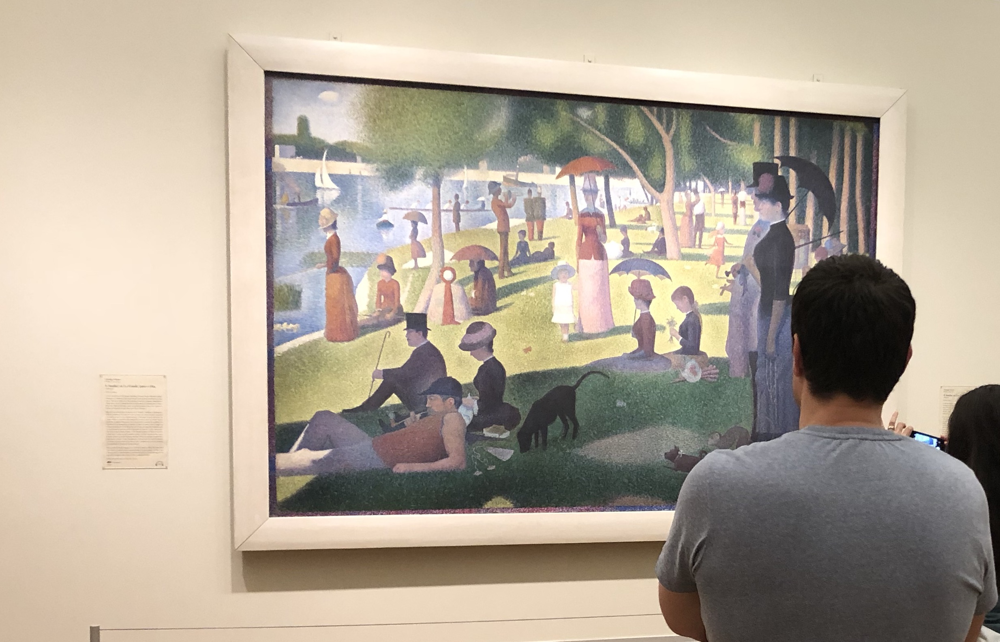

This might be rich coming from a person you’ve never met in person. Or, more accurately, I should say <em>nearly</em> met in person.

In the autumn of 2018, I travelled all the way from Scotland to Chicago to hear you talk at An Event Apart. I made the journey with my former colleague, Laurence “[Fuzzy Logic](https://fuzzylogic.me/)” Hughes. He tuned me into web standards and the whole “A ~thing~ Apart” universe. He was the one who said we should do it. I’m very glad that we did.

Looking back today, I suppose that none of us realised that we were in the [autumn of An Event Apart](https://aneventapart.com/).

We arrived in the windy city a couple of days early so we could see the place. We trawled record store bins. We set sail on the boat tour. We had dinner in the Chicago Athletic Association and imagined meeting characters from a John Hughes movie.

I even took myself off to watch a random high school football game (Go UCW Warriors!) and found myself sitting next to the school principal who sent me a package of team T-shirts when I got home. I’m wearing one of them today.

We spent the night before the conference in a dive bar out towards Wicker Park. We drank too much beer and danced like no–one was watching. Because no–one was watching. It was empty apart from us, the barman and a handful of regulars who gave the guys with the funny accents a wide berth. “So you guys are Irish, right?”

We made our way back to the hotel, probably later than we should, and got ready for the main event. We woke up on the Monday morning and made our way to the conference venue and couldn’t wait to drink it all in.

First up: the Great Jeffrey Zeldman talking about the The Content Performance Quotient. Or so I’m told. I spent most of the talk nipping outside to take the riverside air.

Having pulled myself together, I saw you milling around in the lobby between talks. I thought that this is my chance to say hello. But I bottled it.

I wish I had had the courage.

I guess I assumed that there would be another An Event Apart in the future. By which time I would be a bit cooler, a bit more credible and perhaps there was a chance I could be a speaker myself. So you’d maybe know a bit about me and it would be easier to break the ice.

It is sad, for me, that that chance is gone. The whole scene around the An Event Part events was, or I should say is, more than the sum of its parts. I feel like it will live on through the young(er) team like [Jen Simmons](https://jensimmons.com/), [Brad Frost](https://bradfrost.com/), [Dave Rupert](https://daverupert.com/), [Mina Markham](http://mina.codes/#%F0%9F%92%8B) and the others, but maybe I’m too romantic about it.

Jumping back to Chicago 2018, the event itself was amazing. I learned loads. I found my tribe. Heck, this was a conference that played songs from [Weasels Ripped My Flesh](https://open.spotify.com/playlist/2IZT1o9xYFquH1xiJ38HVi?si=2702f65713424c8f) between talks!

So thank you, Jeffrey, for the part you played in putting it all together. And Happy Birthday from a guy you’ve nearly met.