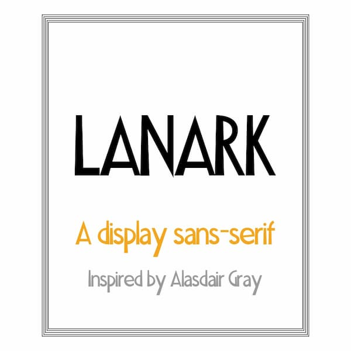
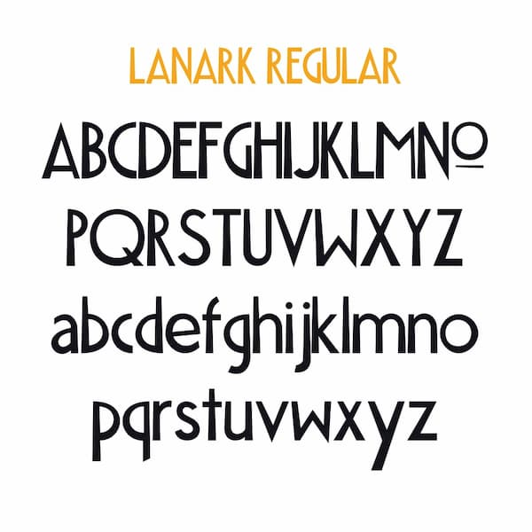

## Lanark: a font in 1 weight

A striking, humanist display font inspired by Alasdair Gray's distinctive type is now [available to buy](https://gumroad.com/l/lanark-font).

It draws from the lettering created by the Scottish writer, artist and polymath, Alasdair Gray who The Guardian newspaper called “the father figure of the renaissance in Scottish literature and art”. 

Versions of this type appear in his books, on illustrations, on paintings and in murals — notably at the [Hillhead Station](https://www.geograph.org.uk/photo/3266850) of the Glasgow Underground.

Lanark, named after [his most famous novel](https://canongate.co.uk/books/28-lanark-a-life-in-four-books/), is a display, sans-serif in one weight: Regular. It is ideal for large formats like headings, posters and signs.

Includes upper and lowercase, numbers, and punctuation. The download includes Regular weight in OpenType format for use on PC and Macs. It also includes .woff and .woff2 formats for use on the web.

[Buy Lanark: a Font in 1 Weight →](https://gumroad.com/l/lanark-font)